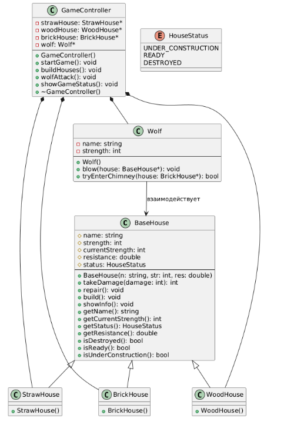
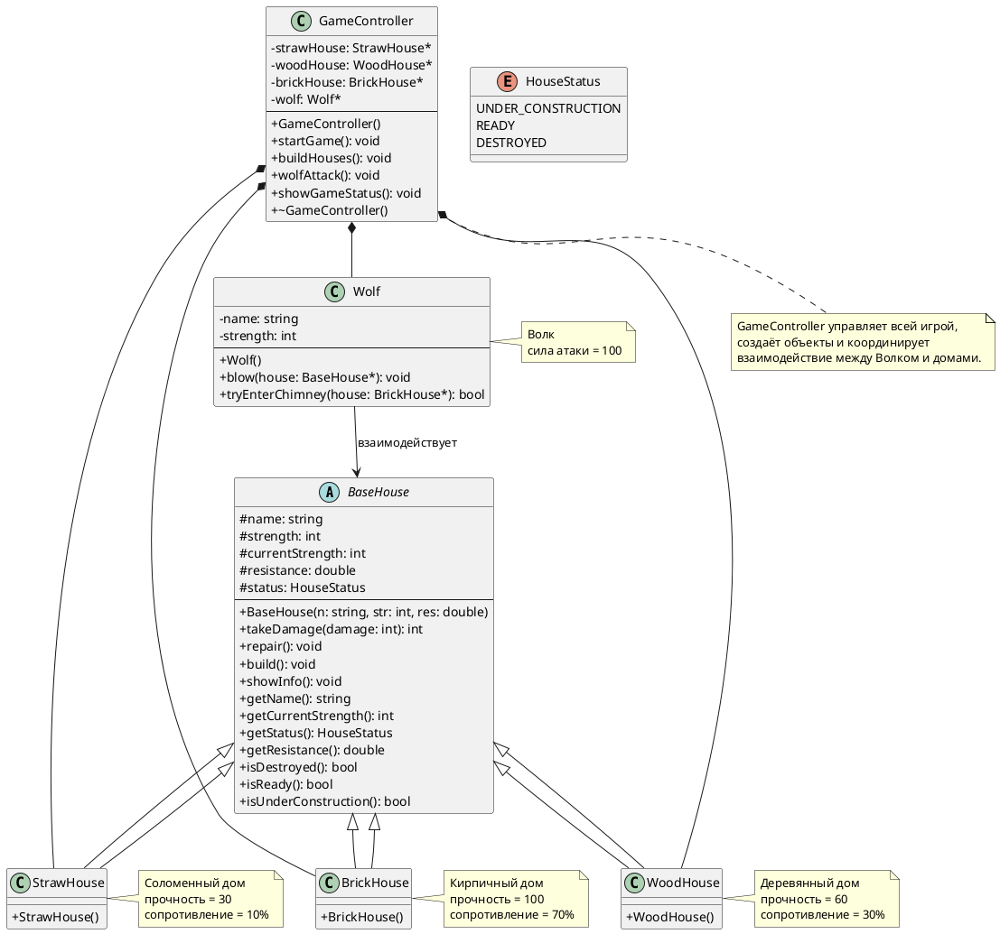

# Class Diagram: Система "Три поросёнка"

## Обзор

Эта диаграмма классов показывает объектно-ориентированную структуру системы сказки "Три поросёнка".

## Иерархия классов

### Иерархия домов

| Class | Type | Attributes | Methods |
|-------|------|------------|---------|
| BaseHouse | Abstract | # name: string<br># strength: int<br># currentStrength: int<br># resistance: double<br># status: HouseStatus | + BaseHouse(n: string, str: int, res: double)<br>+ takeDamage(damage: int): int<br>+ repair(): void<br>+ build(): void<br>+ showInfo(): void<br>+ getName(): string<br>+ getCurrentStrength(): int<br>+ getStatus(): HouseStatus<br>+ getResistance(): double<br>+ isDestroyed(): bool<br>+ isReady(): bool<br>+ isUnderConstruction(): bool |
| StrawHouse | Concrete | strength = 30<br>resistance = 0.1 (10%) | extends BaseHouse |
| WoodHouse | Concrete | strength = 60<br>resistance = 0.3 (30%) | extends BaseHouse |
| BrickHouse | Concrete | strength = 100<br>resistance = 0.7 (70%) | extends BaseHouse |

### Иерархия персонажей

| Class | Type | Attributes | Methods |
|-------|------|------------|---------|
| Wolf | Concrete | - name: string<br>- strength: int = 100 | + Wolf()<br>+ blow(house: BaseHouse*): void<br>+ tryEnterChimney(house: BrickHouse*): bool |

### Контроллер игры

| Класс | Тип | Атрибуты | Методы |
|-------|------|----------|--------|
| GameController | Concrete | - strawHouse: StrawHouse*<br>- woodHouse: WoodHouse*<br>- brickHouse: BrickHouse*<br>- wolf: Wolf* | + GameController()<br>+ startGame(): void<br>+ buildHouses(): void<br>+ wolfAttack(): void<br>+ showGameStatus(): void<br>+ ~GameController() |

### Перечисление

| Enum | Values |
|------|--------|
| HouseStatus | UNDER_CONSTRUCTION<br>READY<br>DESTROYED |

## Связи

- **BaseHouse** <|-- **StrawHouse**: наследует
- **BaseHouse** <|-- **WoodHouse**: наследует
- **BaseHouse** <|-- **BrickHouse**: наследует
- **GameController** *-- **StrawHouse**: композиция (владеет)
- **GameController** *-- **WoodHouse**: композиция (владеет)
- **GameController** *-- **BrickHouse**: композиция (владеет)
- **GameController** *-- **Wolf**: композиция (владеет)
- **Wolf** --> **BaseHouse**: взаимодействует (ассоциация)

## Шаблоны проектирования

### Фабричный метод (в GameController)

```java
public void buildHouses() {
    strawHouse = new StrawHouse();
    woodHouse = new WoodHouse();
    brickHouse = new BrickHouse();
}
```
## Диаграмма




