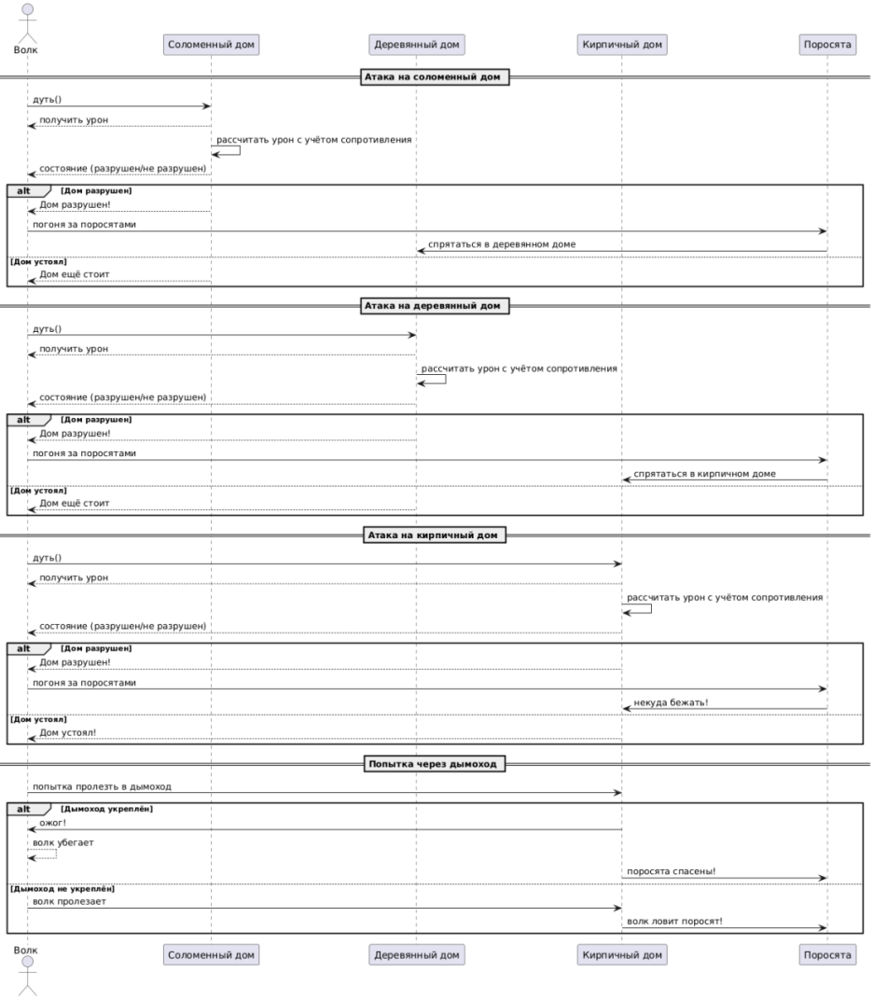
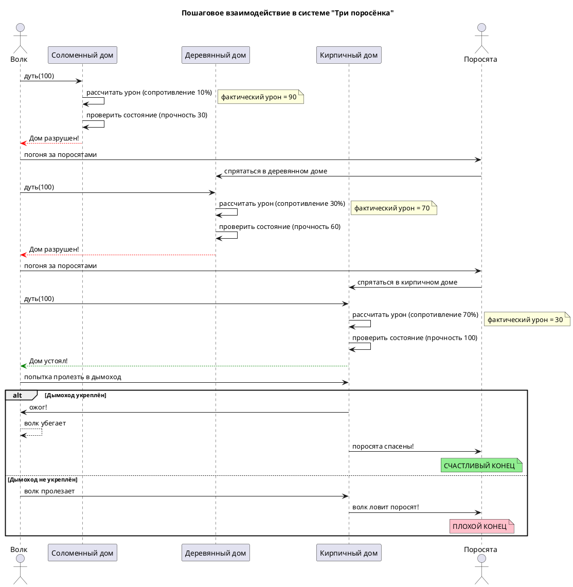

# Sequence Diagram: Взаимодействие в системе "Три поросёнка"

## Обзор

Эта диаграмма последовательности показывает пошаговое взаимодействие между Волком, домами и поросятами в системе "Три поросёнка". Волк последовательно атакует три дома, каждый раз проверяя их состояние. В зависимости от прочности дома и успешности атаки поросята либо убегают к следующему дому, либо остаются на месте. В случае с кирпичным домом возможна дополнительная попытка Волка пролезть в дымоход.

## Актеры и участники

| Актер/Участник | Описание |
|----------------|-------------|
| Волк (Wolf) | Волк, который атакует дома и пытается съесть поросят |
| Соломенный дом (StrawHouse) | Дом из соломы (прочность = 30, сопротивление = 10%) |
| Деревянный дом (WoodHouse) | Дом из дерева (прочность = 60, сопротивление = 30%) |
| Кирпичный дом (BrickHouse) | Дом из кирпича (прочность = 100, сопротивление = 70%) |
| Поросята (Pigs) | Поросята, которые прячутся и убегают от Волка |

## Взаимодействие

### Шаг 1: Атака на соломенный дом

- Волк дует на соломенный дом с силой = 100
- Соломенный дом рассчитывает урон с учётом сопротивления (10%)
- Фактический урон = 100 × (1 - 0,1) = 90
- Соломенный дом проверяет состояние: прочность (30) < урон (90) → дом разрушен
- Соломенный дом сообщает Волку, что дом разрушен
- Волк начинает погоню за поросятами
- Поросята прячутся в деревянном доме

### Шаг 2: Атака на деревянный дом

- Волк дует на деревянный дом с силой = 100
- Деревянный дом рассчитырует урон с учётом сопротивления (30%)
- Фактический урон = 100 × (1 - 0,3) = 70
- Деревянный дом проверяет состояние: прочность (60) < урон (70) → дом разрушен
- Деревянный дом сообщает Волку, что дом разрушен
- Волк начинает погоню за поросятами
- Поросята прячутся в кирпичном доме

### Шаг 3: Атака на кирпичный дом

- Волк дует на кирпичный дом с силой = 100
- Кирпичный дом рассчитырует урон с учётом сопротивления (70%)
- Фактический урон = 100 × (1 - 0,7) = 30
- Кирпичный дом проверяет состояние: прочность (100) > урон (30) → дом устоял
- Кирпичный дом сообщает Волку, что дом устоял

### Шаг 4: Попытка пролезть в дымоход

- Волк пытается пролезть в дымоход кирпичного дома

**Если дымоход укреплён:**
- Кирпичный дом наносит Волку ожог
- Волк убегает
- Поросята спасены

**Если дымоход не укреплён:**
- Волк пролезает в дом
- Волк ловит поросят

## Ключевые наблюдения

1. Соломенный дом разрушается при первой же атаке Волка (30 < 90)
2. Деревянный дом также разрушается при атаке Волка (60 < 70)
3. Кирпичный дом выдерживает атаку Волка благодаря высокому сопротивлению (100 > 30)
4. После разрушения соломенного и деревянного домов поросята убегают к следующему брату
5. Исход атаки на кирпичный дом зависит от того, укреплён ли дымоход

## Расчёт урона с учётом сопротивления

| Тип дома | Прочность | Сопротивление | Сила атаки | Фактический урон | Разрушен? |
|----------|-----------|---------------|------------|------------------|-----------|
| Соломенный | 30 | 10% | 100 | 90 | Да |
| Деревянный | 60 | 30% | 100 | 70 | Да |
| Кирпичный | 100 | 70% | 100 | 30 | Нет |

## Диаграмма

