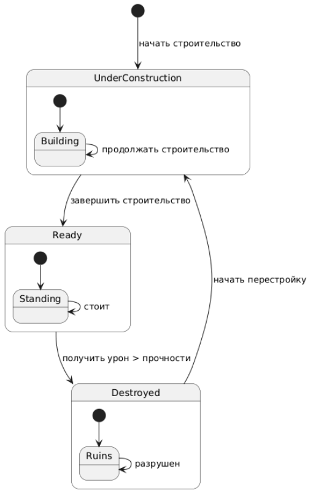
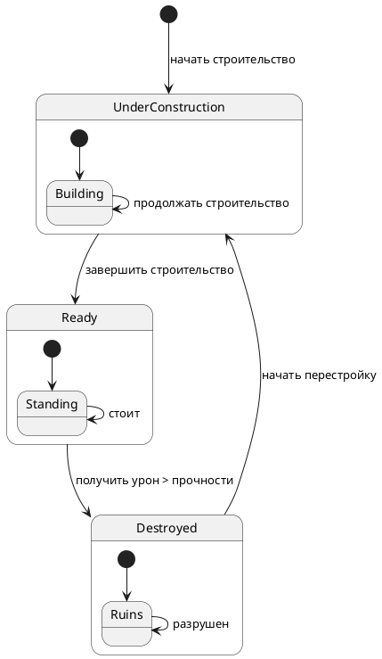

# State Diagram: Жизненный цикл дома

## Обзор

Эта диаграмма состояний показывает жизненный цикл дома в системе "Три поросёнка". Дом последовательно проходит через три основных состояния: `UnderConstruction` (строится), `Ready` (готов) и `Destroyed` (разрушен). Переходы между состояниями происходят под воздействием внешних событий: завершение строительства, получение урона от Волка или начало перестройки.

## Состояния

### Состояние `UnderConstruction` (Строится)

Начальное состояние дома. В этом состоянии дом ещё не готов к защите от Волка.

| Характеристика | Описание |
|----------------|----------|
| Вход в состояние | Начало строительства (`[*] --> UnderConstruction`) |
| Действие в состоянии | `Building` – процесс строительства |
| Выход из состояния | Завершение строительства (переход в `Ready`) |

### Подсостояния:

| Подсостояние | Описание |
|--------------|----------|
| `Building` | Базовое подсостояние, в котором находится дом во время строительства |
| `Building --> Building` | Дом может оставаться в процессе строительства (продолжать строиться) |

### Состояние `Ready` (Готов)

Дом полностью построен и готов к защите от Волка.

| Характеристика | Описание |
|----------------|----------|
| Вход в состояние | Завершение строительства (`UnderConstruction --> Ready`) |
| Действие в состоянии | `Standing` – дом стоит и защищает поросят |
| Выход из состояния | Получение урона, превышающего прочность (переход в `Destroyed`) |

**Подсостояния:**

| Подсостояние | Описание |
|--------------|----------|
| `Standing` | Базовое подсостояние, в котором дом стоит и функционирует |
| `Standing --> Standing` | Дом может оставаться в состоянии готовности (стоять) |

### Состояние `Destroyed` (Разрушен)

Дом разрушен в результате атаки Волка и больше не может защищать поросят.

| Характеристика | Описание |
|----------------|----------|
| Вход в состояние | Получение урона, превышающего прочность (`Ready --> Destroyed`) |
| Действие в состоянии | `Ruins` – дом превратился в руины |
| Выход из состояния | Начало перестройки (переход в `UnderConstruction`) |

**Подсостояния:**

| Подсостояние | Описание |
|--------------|----------|
| `Ruins` | Базовое подсостояние, в котором дом находится в разрушенном состоянии |
| `Ruins --> Ruins` | Дом может оставаться разрушенным |

## Переходы между состояниями

| Откуда | Куда | Событие | Условие | Описание |
|--------|------|---------|---------|----------|
| `[*]` | `UnderConstruction` | Начать строительство | - | Создание нового дома, начало строительства |
| `UnderConstruction` | `Ready` | Завершить строительство | Строительство окончено | Дом построен и готов к защите |
| `Ready` | `Destroyed` | Получить урон > прочности | Урон превышает текущую прочность | Волк разрушил дом |
| `Destroyed` | `UnderConstruction` | Начать перестройку | - | Восстановление разрушенного дома |

## Условия переходов

| Переход | Условие | Объяснение |
|---------|---------|------------|
| UnderConstruction → Ready | Строительство окончено | Поросята завершили строительство дома |
| Ready → Destroyed | Урон > прочности | Волк нанёс урон, превышающий прочность дома |
| Destroyed → UnderConstruction | Начать перестройку | Поросята начинают восстанавливать разрушенный дом |

## Параметры домов в разных состояниях

| Тип дома | Прочность | Сопротивление | Разрушается? |
|----------|-----------|---------------|---------------|
| Соломенный | 30 | 10% | Да (при силе атаки 100) |
| Деревянный | 60 | 30% | Да (при силе атаки 100) |
| Кирпичный | 100 | 70% | Нет (при силе атаки 100) |

## Диаграмма

