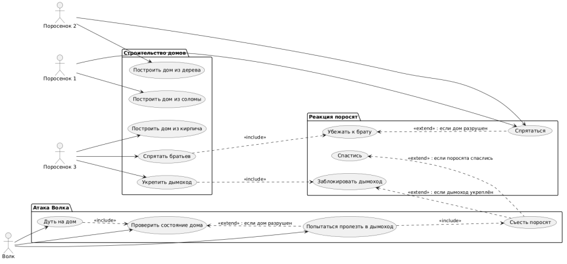
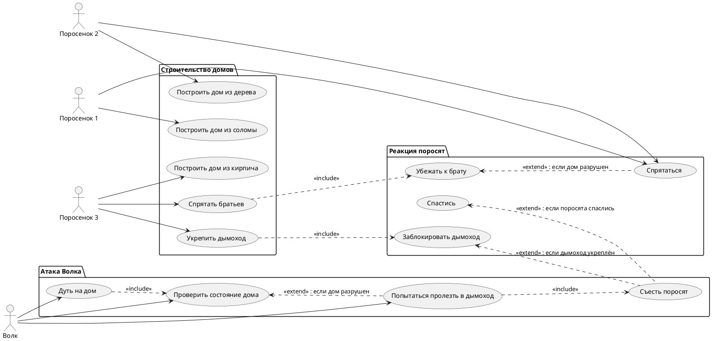

# Use Case Diagram: Система "Три поросёнка"

## Актеры

| Актер | Описание |
|-------|----------|
| Поросенок 1 | Первый поросёнок, который строит дом из соломы |
| Поросенок 2 | Второй поросёнок, который строит дом из дерева |
| Поросенок 3 | Третий поросёнок, который строит дом из кирпича, прячет братьев и укрепляет дымоход |
| Волк | Волк, который атакует дома и пытается съесть поросят |

## Варианты использования

### Пакет: Строительство домов

| Вариант использования | Описание |
|-----------------------|----------|
| Построить дом из соломы | Первый поросёнок строит дом из соломы (низкая прочность, слабое сопротивление) |
| Построить дом из дерева | Второй поросёнок строит дом из дерева (средняя прочность, среднее сопротивление) |
| Построить дом из кирпича | Третий поросёнок строит дом из кирпича (высокая прочность, высокое сопротивление) |
| Спрятать братьев | Третий поросёнок прячет братьев в своём доме |
| Укрепить дымоход | Третий поросёнок укрепляет дымоход, чтобы волк не мог пролезть |

### Пакет: Атака Волка

| Вариант использования | Описание |
|-----------------------|----------|
| Дуть на дом | Волк дует на дом, пытаясь его разрушить |
| Проверить состояние дома | Волк проверяет, разрушился дом или нет |
| Попытаться пролезть в дымоход | Волк пытается пролезть в дымоход кирпичного дома |
| Съесть поросят | Волк съедает поросят, если ему это удаётся |

### Пакет: Реакция поросят

| Вариант использования | Описание |
|-----------------------|----------|
| Спрятаться | Поросята прячутся в своих домах |
| Убежать к брату | Поросята убегают к третьему брату, когда их дом разрушен |
| Заблокировать дымоход | Третий поросёнок блокирует дымоход, не давая волку пролезть |
| Спастись | Поросята спасаются от волка |

## Связи

### Актер к варианту использования

- **Поросенок 1** выполняет: Построить дом из соломы, Спрятаться
- **Поросенок 2** выполняет: Построить дом из дерева, Спрятаться
- **Поросенок 3** выполняет: Построить дом из кирпича, Спрятать братьев, Укрепить дымоход
- **Волк** выполняет: Дуть на дом, Проверить состояние дома, Попытаться пролезть в дымоход

### Отношения Extend/Include

- **Спрятать братьев** →→ **Убежать к брату** (<<include>>)
- **Спрятаться** ←← **Убежать к брату** (<<extend>>): если дом разрушен
- **Укрепить дымоход** →→ **Заблокировать дымоход** (<<include>>)
- **Дуть на дом** →→ **Проверить состояние дома** (<<include>>)
- **Проверить состояние дома** ←← **Попытаться пролезть в дымоход** (<<extend>>): если дом разрушен
- **Попытаться пролезть в дымоход** →→ **Съесть поросят** (<<include>>)
- **Съесть поросят** ←← **Заблокировать дымоход** (<<extend>>): если дымоход укреплён
- **Съесть поросят** ←← **Спастись** (<<extend>>): если поросята спаслись

## Диаграмма

